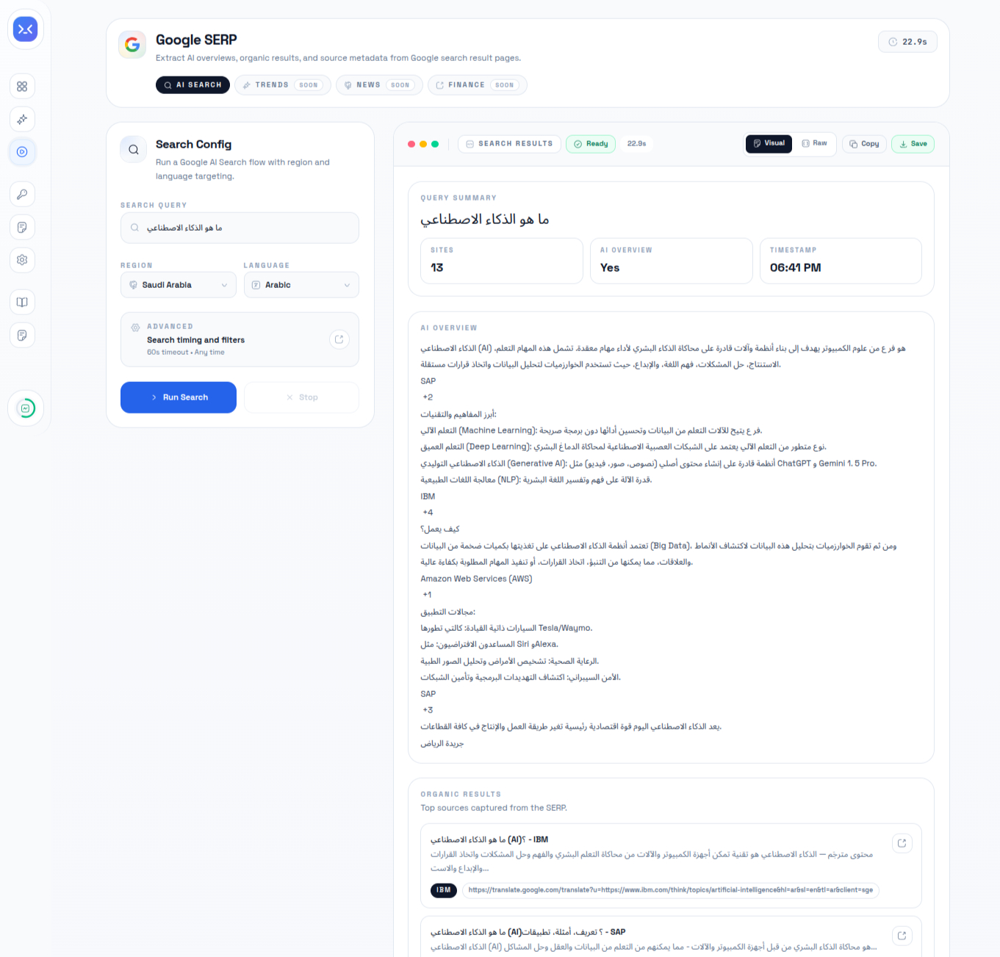
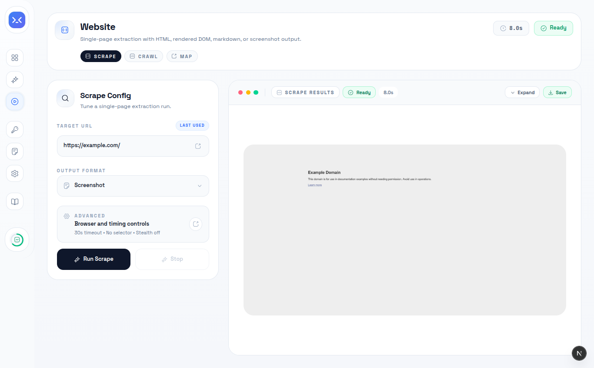
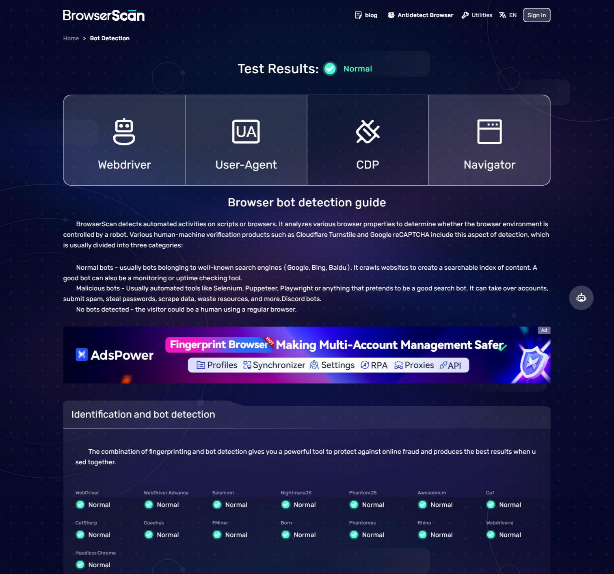
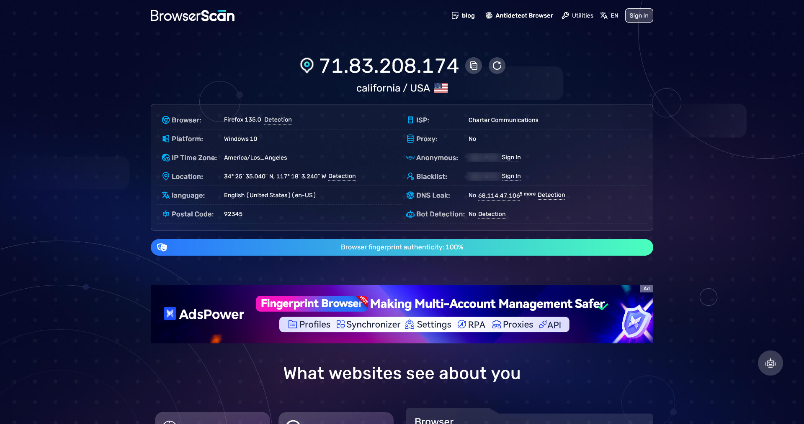

<div align="center">


### **The World's Most Advanced Anti-Detection Scraping Full Stack Web App**

<br/>

[](https://github.com/)
[](https://github.com/)
[](https://github.com/)
[](https://github.com/)

<br/>

[](https://nodejs.org/)
[](https://nextjs.org/)
[](https://github.com/AurelicButter/camoufox)
[](https://www.typescriptlang.org/)
[](https://playwright.dev/)

<br/>

[](LICENSE)
[](CONTRIBUTING.md)
[](https://github.com/)
[](https://github.com/)

---

### 🎯 **0% Detection Rate** on all major anti-bot systems

*Powered by **Camoufox** — Firefox with C++ level fingerprint spoofing*

[📖 Documentation](#-api-endpoints) • [🚀 Quick Start](#-quick-start) • [🐛 Report Bug](https://github.com/) • [✨ Request Feature](https://github.com/)

</div>

---

## 🆕 What's New in V2.0

<div align="center">

|           🦊 **Camoufox Engine**           |              🛡️ **0% Detection**              |      ⚡ **3x Faster**      |
| :---------------------------------------: | :------------------------------------------: | :-----------------------: |
| Firefox with binary-level stealth patches | Passes CreepJS, Sannysoft, & all major tests | Optimized context pooling |

</div>

### V2.0 Changelog

```diff
+ 🦊 NEW: Camoufox browser engine (replaces Chromium + stealth plugins)
+ 🛡️ NEW: 0% headless detection rate (was 67%+)
+ 🔒 NEW: Built-in WebRTC leak protection
+ 🎭 NEW: C++ level Canvas/WebGL/AudioContext fingerprint spoofing
+ ⚡ IMPROVED: Faster browser launches with persistent contexts
+ 🧹 REMOVED: playwright-extra (no longer needed)
+ 🧹 REMOVED: puppeteer-extra-plugin-stealth (no longer needed)
```

---

## 📊 Detection Benchmark Comparison

<table align="center">
<tr>
<th>Tool</th>
<th>Headless Detection</th>
<th>Stealth Score</th>
<th>Engine</th>
</tr>
<tr>
<td><strong>🦊 HeadlessX V2.0 (Camoufox)</strong></td>
<td>✅ <strong>0%</strong></td>
<td>✅ <strong>0%</strong></td>
<td>Firefox (C++ patched)</td>
</tr>
<tr>
<td>HeadlessX V1 (Playwright Extra)</td>
<td>❌ 67%</td>
<td>⚠️ 50%</td>
<td>Chromium (JS patches)</td>
</tr>
<tr>
<td>Puppeteer Stealth</td>
<td>❌ 33%</td>
<td>❌ 80%</td>
<td>Chromium (JS patches)</td>
</tr>
<tr>
<td>Vanilla Playwright</td>
<td>❌ 100%</td>
<td>❌ 100%</td>
<td>Chromium</td>
</tr>
<tr>
<td>Vanilla Selenium</td>
<td>❌ 100%</td>
<td>❌ 100%</td>
<td>Chrome</td>
</tr>
</table>

*Lower scores = better (0% = undetectable)*


---

## 🤖 Scrapers

<div align="center">

|  **Google SERP** |          🌐 **Website Scraping**           |
| :----------------------------------------------------------------------: | :---------------------------------------: |
|                Extract search results with zero detection                | Scrape any website with full JS rendering |
|                                ✅ **Live**                                |                ✅ **Live**                 |

### Coming Soon

|  **Amazon** |  **LinkedIn** |  **Twitter** |  **Instagram** |
| :-----------------------------------------------------------------: | :---------------------------------------------------------------------: | :-------------------------------------------------------------------: | :-----------------------------------------------------------------------: |
|                          Product & Reviews                          |                         Job Listings & Profiles                         |                            Tweets & Trends                            |                              Posts & Stories                              |

</div>

---

## 🖥️ UI Screenshots

### Google SERP Scraper


### Website Scraper


---

## 📸 Proof of Undetectability

### BrowserScan (100% Passed)


<div align="center">

|        **Pixelscan (Human Detection)**         |       **Profile Tested with Proxy**        |
| :--------------------------------------------: | :----------------------------------------: |
|  |  |

</div>

---

## 📋 Table of Contents

- [🆕 What's New in V2.0](#-whats-new-in-v20)
  - [V2.0 Changelog](#v20-changelog)
- [📊 Detection Benchmark Comparison](#-detection-benchmark-comparison)
- [🤖 Scrapers](#-scrapers)
  - [Coming Soon](#coming-soon)
- [📸 Proof of Undetectability](#-proof-of-undetectability)
  - [BrowserScan (100% Passed)](#browserscan-100-passed)
- [📋 Table of Contents](#-table-of-contents)
- [⚡ Quick Start](#-quick-start)
  - [1️⃣ Install Dependencies](#1️⃣-install-dependencies)
  - [2️⃣ Setup Database](#2️⃣-setup-database)
  - [3️⃣ Start the System](#3️⃣-start-the-system)
  - [3️⃣ Access the Dashboard](#3️⃣-access-the-dashboard)
- [🔥 Key Features](#-key-features)
  - [🦊 Camoufox Stealth Engine (V2.0)](#-camoufox-stealth-engine-v20)
  - [🖥️ Modern Dashboard](#️-modern-dashboard)
- [🌐 API Endpoints](#-api-endpoints)
  - [Core Scraping APIs](#core-scraping-apis)
  - [Example Request](#example-request)
  - [Example Response](#example-response)
- [Configuration](#configuration)
  - [Environment Variables](#environment-variables)
  - [Dashboard Settings](#dashboard-settings)
- [🛠️ Manual Setup](#️-manual-setup)
  - [Backend](#backend)
  - [Frontend](#frontend)
- [🤝 Contributing](#-contributing)
- [📝 License](#-license)
- [🌟 Star History](#-star-history)
  - [Built with ❤️ using cutting-edge technologies](#built-with-️-using-cutting-edge-technologies)

---

## ⚡ Quick Start

> **Prerequisites**: [Node.js 18+](https://nodejs.org/), [pnpm 9+](https://pnpm.io/)

### 1️⃣ Install Dependencies

```bash
cd HeadlessX

# Install all dependencies (pnpm required - npm/yarn will fail)
pnpm install

# Download Camoufox browser (runs automatically on install)
pnpm camoufox:fetch
```

### 2️⃣ Setup Database

```bash
# Push schema to database
pnpm db:push

# Or run migrations
pnpm db:migrate
```

### 3️⃣ Start the System

```bash
# Start both frontend and backend
pnpm dev
```

Or start individually:

<table>
<tr>
<td><strong>Windows</strong></td>
<td><strong>Linux / macOS</strong></td>
</tr>
<tr>
<td>

```powershell
scripts\start_windows.bat
```

</td>
<td>

```bash
./scripts/start.sh
```

</td>
</tr>
</table>

### 3️⃣ Access the Dashboard

<table>
<tr>
<td>🔗 <strong>Backend API</strong></td>
<td><a href="http://localhost:3001">http://localhost:3001</a></td>
</tr>
<tr>
<td>🖥️ <strong>Dashboard</strong></td>
<td><a href="http://localhost:3000">http://localhost:3000</a></td>
</tr>
</table>

---

## 🔥 Key Features

<table>
<tr>
<td width="50%">

### 🦊 Camoufox Stealth Engine (V2.0)

| Feature                    | Description                         |
| -------------------------- | ----------------------------------- |
| 🔒 **Binary-Level Patches** | Firefox modified at C++ level       |
| 🎭 **Fingerprint Spoofing** | Canvas, WebGL, AudioContext         |
| 🌐 **WebRTC Protection**    | No IP leaks in headless mode        |
| 🖱️ **Human Behavior**       | Natural mouse movements & scrolling |
| 📱 **Device Emulation**     | Realistic viewport & user agents    |
| 🚫 **Zero Detection**       | Passes all anti-bot tests           |

</td>
<td width="50%">

### 🖥️ Modern Dashboard

| Feature            | Description                     |
| ------------------ | ------------------------------- |
| ⚛️ **Next.js 16**   | React 19 with Turbopack         |
| 🎨 **HeroUI**       | Beautiful dark/light mode UI    |
| ⚙️ **Live Config**  | Change settings without restart |
| 📊 **Request Logs** | Full history with screenshots   |
| 🧪 **Playground**   | Test scraping in real-time      |
| 🔑 **API Keys**     | Secure key management           |

</td>
</tr>
</table>

---

## 🌐 API Endpoints

### Website Scraping APIs

| Endpoint                  | Method | Description                  |
| ------------------------- | ------ | ---------------------------- |
| `/api/website/html`       | `POST` | Get raw HTML (fast)          |
| `/api/website/html-js`    | `POST` | Get HTML with JS rendering   |
| `/api/website/content`    | `POST` | Get Markdown content         |
| `/api/website/screenshot` | `POST` | Capture full-page Screenshot |
| `/api/website/stream`     | `POST` | Real-time SSE Stream         |

### Google SERP APIs

| Endpoint                  | Method | Description                   |
| ------------------------- | ------ | ----------------------------- |
| `/api/google-serp/search` | `POST` | Extract Google search results |
| `/api/google-serp/stream` | `GET`  | Real-time SSE Stream          |

### Example Request

```bash
curl -X POST http://localhost:3001/api/website/html \
  -H "Content-Type: application/json" \
  -H "X-API-Key: your-api-key" \
  -d '{"url": "https://example.com", "stealth": true}'
```

### Example Response

```json
{
  "success": true,
  "data": {
    "url": "https://example.com",
    "title": "Example Domain",
    "html": "<!DOCTYPE html>...",
    "statusCode": 200
  }
}
```

---

##  Configuration

### Environment Variables

> ⚠️ **Note**: Most configuration (Browsers, Stealth, Proxy, Timeouts) is managed directly via the **Dashboard Settings**.

Only the following core variables are required in `.env`:

| Variable              | Default                 | Description                |
| --------------------- | ----------------------- | -------------------------- |
| `PORT`                | `3001`                  | Backend API port           |
| `DATABASE_URL`        | -                       | Supabase Connection String |
| `NEXT_PUBLIC_API_URL` | `http://localhost:3001` | Frontend API URL           |

### Dashboard Settings

Configure these live at `/settings`:

#### General Configuration
- **Headless Mode**: Run browser without UI (faster execution)
- **Browser Timeout**: Max execution time per job (default: 60000ms)
- **Max Concurrent Jobs**: Concurrent scraping jobs (recommended: 3-8)

#### Browser Engine (Camoufox)
- **Block WebRTC**: Prevent IP leaks via WebRTC
- **Camoufox GeoIP**: Spoof location based on IP
- **Enable Cache**: Cache resources for speed

#### Proxies
- Manage proxy configurations and rotation settings


---

## 🛠️ Manual Setup

### Backend

```bash
cd backend
pnpm install
npx camoufox-js fetch    # Download stealth Firefox
pnpm dev                 # Start dev server
```

### Frontend

```bash
cd frontend
pnpm install
pnpm dev
```

---

## 🤝 Contributing

Contributions are welcome! Please read our [Contributing Guide](CONTRIBUTING.md) for details.

1. Fork the repository
2. Create your feature branch (`git checkout -b feature/amazing-feature`)
3. Commit your changes (`git commit -m 'Add amazing feature'`)
4. Push to the branch (`git push origin feature/amazing-feature`)
5. Open a Pull Request

---

## 📝 License

This project is licensed under the **MIT License** - see the [LICENSE](LICENSE) file for details.

---

<div align="center">

## 🌟 Star History

If you find HeadlessX useful, please consider giving it a star! ⭐

---

### Built with ❤️ using cutting-edge technologies

<br/>

[](https://nodejs.org/)
[](https://nextjs.org/)
[](https://github.com/)
[](https://playwright.dev/)
[](https://www.typescriptlang.org/)
[](https://react.dev/)
[](https://tailwindcss.com/)
[](https://www.prisma.io/)

<br/>

**🦊 HeadlessX V2.0 — Undetectable by Design**

*© 2026 HeadlessX. All rights reserved.*

</div>
