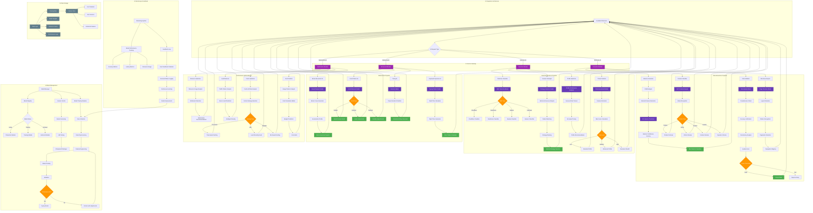

```mermaid
graph TB
    subgraph "AI Integration Architecture"
        A[HeadlessX Backend] --> B{AI Request Type}
    end
    
    subgraph "AI Service Gateway"
        B -->|Behavioral AI| C[Behavioral Module]
        B -->|Detection AI| D[Detection Module]
        B -->|Extraction AI| E[Extraction Module]
        B -->|Optimization AI| F[Optimization Module]
    end
    
    subgraph "Behavioral AI System"
        C --> C1[Mouse Movement AI]
        C --> C2[Keyboard Dynamics AI]
        C --> C3[Scroll Pattern AI]
        C --> C4[Timing AI]
        
        C1 --> G1[Neural Network Model]
        G1 --> G2[Bezier Curve Generator]
        G2 --> G3[Acceleration Profiler]
        G3 --> G4[Micro-movement Injector]
        
        C2 --> H1[Typing Pattern Model]
        H1 --> H2[Dwell Time Calculator]
        H2 --> H3[Flight Time Generator]
        H3 --> H4[Error Pattern Simulator]
        
        C3 --> I1[Scroll Behavior Model]
        I1 --> I2{Scroll Type}
        I2 -->|Reader| I3[Smooth Linear Scroll]
        I2 -->|Scanner| I4[Quick Jump Scroll]
        I2 -->|Browser| I5[Variable Speed Scroll]
        
        C4 --> J1[Attention Model]
        J1 --> J2[Pause Duration Predictor]
        J2 --> J3[Interaction Delay Generator]
    end
    
    subgraph "Detection Evasion AI System"
        D --> D1[Detection Classifier]
        D --> D2[Evasion Strategist]
        D --> D3[Threat Predictor]
        D --> D4[Profile Optimizer]
        
        D1 --> K1[WAF Detection Model]
        K1 --> K2{WAF Type}
        K2 -->|Cloudflare| K3[Cloudflare Classifier]
        K2 -->|DataDome| K4[DataDome Classifier]
        K2 -->|Akamai| K5[Akamai Classifier]
        K2 -->|Unknown| K6[Generic Classifier]
        
        D2 --> L1[Strategy Selection Model]
        L1 --> L2[Historical Success Analysis]
        L2 --> L3[Pattern Matching]
        L3 --> L4[Strategy Ranking]
        L4 --> L5[Optimal Strategy Selection]
        
        D3 --> M1[Risk Assessment Model]
        M1 --> M2[Feature Extraction]
        M2 --> M3[Risk Score Calculation]
        M3 --> M4{Risk Level}
        M4 -->|Low| M5[Standard Profile]
        M4 -->|Medium| M6[Enhanced Profile]
        M4 -->|High| M7[Maximum Stealth]
        
        D4 --> N1[Profile Performance Analyzer]
        N1 --> N2[Success Rate Tracker]
        N2 --> N3[ML-based Tuning]
        N3 --> N4[Profile Recommendation]
    end
    
    subgraph "Data Extraction AI System"
        E --> E1[Selector Generator]
        E --> E2[Content Classifier]
        E --> E3[Data Validator]
        E --> E4[Structure Analyzer]
        
        E1 --> O1[DOM Analysis]
        O1 --> O2[Element Feature Extraction]
        O2 --> O3[ML Selector Prediction]
        O3 --> O4[Selector Confidence Scoring]
        O4 --> O5[Best Selector Selection]
        
        E2 --> P1[NLP Content Analysis]
        P1 --> P2[Entity Recognition]
        P2 --> P3{Content Type}
        P3 -->|Product| P4[Product Schema]
        P3 -->|Article| P5[Article Schema]
        P3 -->|Contact| P6[Contact Schema]
        P3 -->|Custom| P7[Dynamic Schema]
        
        E3 --> Q1[Data Quality Model]
        Q1 --> Q2[Completeness Check]
        Q2 --> Q3[Accuracy Verification]
        Q3 --> Q4[Consistency Analysis]
        Q4 --> Q5[Quality Score]
        Q5 --> Q6{Score Threshold}
        Q6 -->|Pass| Q7[Accept Data]
        Q6 -->|Fail| Q8[Reject & Retry]
        
        E4 --> R1[Page Structure Model]
        R1 --> R2[Layout Detection]
        R2 --> R3[Pattern Recognition]
        R3 --> R4[Pagination Detection]
        R4 --> R5[Navigation Mapping]
    end
    
    subgraph "Performance Optimization AI"
        F --> F1[Resource Optimizer]
        F --> F2[Cache Optimizer]
        F --> F3[Load Balancer]
        F --> F4[Cost Predictor]
        
        F1 --> S1[Resource Usage Analysis]
        S1 --> S2[Bottleneck Detection]
        S2 --> S3[Optimization Recommendations]
        
        F2 --> T1[Cache Hit Rate Analysis]
        T1 --> T2[Cache Strategy Selection]
        T2 --> T3{Strategy Type}
        T3 -->|TTL-based| T4[Time-based Caching]
        T3 -->|LRU| T5[Least Recently Used]
        T3 -->|Adaptive| T6[ML-based Caching]
        
        F3 --> U1[Traffic Pattern Analysis]
        U1 --> U2[Server Load Prediction]
        U2 --> U3[Intelligent Routing]
        
        F4 --> V1[Usage Pattern Analysis]
        V1 --> V2[Cost Calculation Model]
        V2 --> V3[Budget Prediction]
        V3 --> V4[Cost Alerts]
    end
    
    subgraph "AI Model Management"
        W[Model Manager] --> W1[Model Registry]
        W1 --> W2{Model Status}
        W2 -->|Active| W3[Production Models]
        W2 -->|Training| W4[Training Models]
        W2 -->|Archived| W5[Historical Models]
        
        W --> X[Version Control]
        X --> X1[Model Versioning]
        X1 --> X2[A/B Testing]
        X2 --> X3[Champion/Challenger]
        
        W --> Y[Model Training Pipeline]
        Y --> Y1[Data Collection]
        Y1 --> Y2[Data Preprocessing]
        Y2 --> Y3[Feature Engineering]
        Y3 --> Y4[Model Training]
        Y4 --> Y5[Validation]
        Y5 --> Y6{Performance OK?}
        Y6 -->|Yes| Y7[Deploy Model]
        Y6 -->|No| Y8[Retrain with Adjustments]
        Y8 --> Y3
    end
    
    subgraph "AI Monitoring & Feedback"
        Z[Monitoring System] --> Z1[Model Performance Tracking]
        Z1 --> Z2[Accuracy Metrics]
        Z1 --> Z3[Latency Metrics]
        Z1 --> Z4[Resource Usage]
        
        Z --> AA[Feedback Loop]
        AA --> AA1[User Feedback Collection]
        AA1 --> AA2[Success/Failure Logging]
        AA2 --> AA3[Continuous Learning]
        AA3 --> AA4[Model Improvement]
        AA4 --> Y1
    end
    
    subgraph "AI Data Storage"
        AB[Data Layer] --> AB1[Training Data]
        AB --> AB2[Model Weights]
        AB --> AB3[Inference Cache]
        AB --> AB4[Performance Logs]
        
        AB1 --> AC[Feature Store]
        AC --> AC1[User Features]
        AC --> AC2[Site Features]
        AC --> AC3[Historical Features]
    end
    
    %% Connections
    G4 --> A
    H4 --> A
    I3 --> A
    I4 --> A
    I5 --> A
    J3 --> A
    
    L5 --> A
    M5 --> A
    M6 --> A
    M7 --> A
    N4 --> A
    
    O5 --> A
    P4 --> A
    P5 --> A
    P6 --> A
    P7 --> A
    Q7 --> A
    R5 --> A
    
    S3 --> A
    T4 --> A
    T5 --> A
    T6 --> A
    U3 --> A
    V4 --> A
    
    %% Styling
    classDef aiCore fill:#9C27B0,stroke:#6A1B9A,color:#fff
    classDef mlModel fill:#673AB7,stroke:#4527A0,color:#fff
    classDef decision fill:#FF9800,stroke:#E65100,color:#fff
    classDef output fill:#4CAF50,stroke:#2E7D32,color:#fff
    classDef storage fill:#607D8B,stroke:#37474F,color:#fff
    
    class C,D,E,F aiCore
    class G1,H1,I1,J1,K1,L1,M1,N1,O3,P1,Q1,R1 mlModel
    class K2,I2,M4,P3,Q6,T3,Y6 decision
    class G4,H4,I3,I4,I5,J3,L5,O5,Q7 output
    class AB,AB1,AB2,AB3,AB4,AC storage
```
