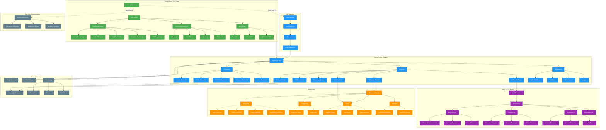

```mermaid
graph TB
    subgraph "Client Layer - Next.js 14+"
        A[Next.js Frontend] --> B[App Router]
        B --> C[Dashboard Pages]
        B --> D[Documentation Pages]
        B --> E[API Routes]
        
        C --> C1[Scraper Interface]
        C --> C2[Profile Manager]
        C --> C3[Workflow Builder]
        C --> C4[Analytics Dashboard]
        C --> C5[API Playground]
        
        D --> D1[API Docs]
        D --> D2[User Guides]
        D --> D3[Tutorials]
        D --> D4[Reference]
        
        E --> E1[Auth API]
        E --> E2[Proxy API]
        E --> E3[WebSocket API]
    end
    
    subgraph "API Gateway"
        F[Nginx/Traefik] --> G[Load Balancer]
        G --> H[Rate Limiter]
        H --> I[Auth Middleware]
    end
    
    subgraph "Server Layer - Node.js"
        I --> J[Express.js API]
        J --> K[Controllers]
        K --> K1[Scraper Controller]
        K --> K2[Profile Controller]
        K --> K3[Workflow Controller]
        K --> K4[Analytics Controller]
        K --> K5[Admin Controller]
        
        J --> L[Services]
        L --> L1[Browser Service]
        L --> L2[Antibot Service]
        L --> L3[Rendering Service]
        L --> L4[AI Service Proxy]
        L --> L5[Database Service]
        L --> L6[Cache Service]
        
        J --> M[Middleware]
        M --> M1[Auth Middleware]
        M --> M2[Validation]
        M --> M3[Error Handler]
        M --> M4[Logger]
    end
    
    subgraph "AI/ML Layer - Python"
        N[FastAPI Service] --> O[AI Services]
        O --> O1[Behavioral AI]
        O --> O2[Detection AI]
        O --> O3[Extraction AI]
        O --> O4[Optimization AI]
        
        O1 --> P1[Mouse Movement Model]
        O1 --> P2[Keyboard Dynamics]
        O1 --> P3[Scroll Patterns]
        
        O2 --> Q1[Detection Classifier]
        O2 --> Q2[Evasion Strategist]
        O2 --> Q3[Threat Predictor]
        
        O3 --> R1[Selector Generator]
        O3 --> R2[Content Classifier]
        O3 --> R3[Data Validator]
    end
    
    subgraph "Data Layer"
        S[Database Cluster]
        S --> T1[MongoDB]
        S --> T2[PostgreSQL]
        S --> T3[Redis]
        S --> T4[InfluxDB]
        
        T1 -.-> U1[Jobs Collection]
        T1 -.-> U2[Profiles Collection]
        T1 -.-> U3[Users Collection]
        T1 -.-> U4[Workflows Collection]
        
        T2 -.-> V1[Analytics Tables]
        T2 -.-> V2[Audit Logs]
        
        T3 -.-> W1[Session Cache]
        T3 -.-> W2[Job Queue]
        T3 -.-> W3[Rate Limit Data]
        
        T4 -.-> X1[Performance Metrics]
        T4 -.-> X2[Detection Events]
    end
    
    subgraph "External Services"
        Y[Playwright Browsers]
        Z[Proxy Services]
        AA[Cloud Storage]
        AB[Monitoring]
        AB --> AB1[Prometheus]
        AB --> AB2[Grafana]
        AB --> AB3[ELK Stack]
    end
    
    subgraph "Real-time Communication"
        AC[WebSocket Server]
        AC --> AD[Job Progress Events]
        AC --> AE[Notification Events]
        AC --> AF[Analytics Updates]
    end
    
    %% Connections
    A -.HTTP/HTTPS.-> F
    A -.WebSocket.-> AC
    E -.-> J
    
    L1 --> Y
    L4 --> N
    L5 --> S
    L6 --> T3
    
    J --> Z
    J --> AA
    J --> AB
    
    K1 --> Y
    
    %% Styling
    classDef frontend fill:#4CAF50,stroke:#2E7D32,color:#fff
    classDef backend fill:#2196F3,stroke:#1565C0,color:#fff
    classDef ai fill:#9C27B0,stroke:#6A1B9A,color:#fff
    classDef data fill:#FF9800,stroke:#E65100,color:#fff
    classDef external fill:#607D8B,stroke:#37474F,color:#fff
    
    class A,B,C,D,E,C1,C2,C3,C4,C5,D1,D2,D3,D4,E1,E2,E3 frontend
    class F,G,H,I,J,K,L,M,K1,K2,K3,K4,K5,L1,L2,L3,L4,L5,L6,M1,M2,M3,M4 backend
    class N,O,O1,O2,O3,O4,P1,P2,P3,Q1,Q2,Q3,R1,R2,R3 ai
    class S,T1,T2,T3,T4,U1,U2,U3,U4,V1,V2,W1,W2,W3,X1,X2 data
    class Y,Z,AA,AB,AB1,AB2,AB3,AC,AD,AE,AF external
```
