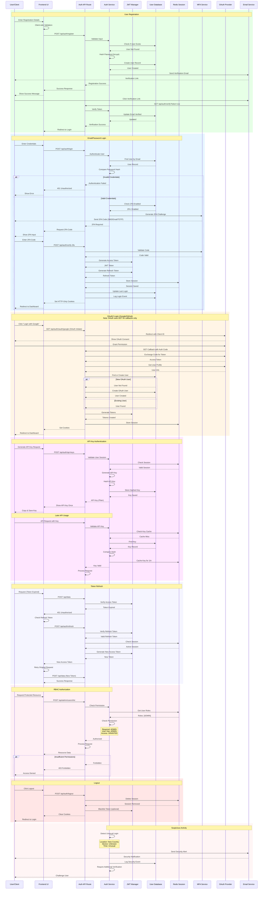

```mermaid
sequenceDiagram
    participant User as User/Client
    participant UI as Frontend UI
    participant AuthAPI as Auth API Route
    participant AuthService as Auth Service
    participant JWT as JWT Manager
    participant DB as User Database
    participant Cache as Redis Session
    participant MFA as MFA Service
    participant OAuth as OAuth Provider
    participant Email as Email Service
    
    %% Registration Flow
    rect rgb(230, 255, 230)
        Note over User,Email: User Registration
        User->>UI: Enter Registration Details
        UI->>UI: Client-side Validation
        UI->>AuthAPI: POST /api/auth/register
        AuthAPI->>AuthService: Validate Input
        AuthService->>DB: Check if User Exists
        DB-->>AuthService: User Not Found
        AuthService->>AuthService: Hash Password (bcrypt)
        AuthService->>DB: Create User Record
        DB-->>AuthService: User Created
        AuthService->>Email: Send Verification Email
        Email-->>User: Verification Link
        AuthService-->>AuthAPI: Registration Success
        AuthAPI-->>UI: Success Response
        UI-->>User: Show Success Message
        
        User->>Email: Click Verification Link
        Email->>AuthAPI: GET /api/auth/verify?token=xxx
        AuthAPI->>AuthService: Verify Token
        AuthService->>DB: Update Email Verified
        DB-->>AuthService: Updated
        AuthService-->>AuthAPI: Verification Success
        AuthAPI-->>UI: Redirect to Login
    end
    
    %% Login Flow - Email/Password
    rect rgb(230, 245, 255)
        Note over User,Cache: Email/Password Login
        User->>UI: Enter Credentials
        UI->>AuthAPI: POST /api/auth/login
        AuthAPI->>AuthService: Authenticate User
        AuthService->>DB: Find User by Email
        DB-->>AuthService: User Record
        AuthService->>AuthService: Compare Password Hash
        
        alt Invalid Credentials
            AuthService-->>AuthAPI: Authentication Failed
            AuthAPI-->>UI: 401 Unauthorized
            UI-->>User: Show Error
        else Valid Credentials
            AuthService->>DB: Check 2FA Enabled
            DB-->>AuthService: 2FA: Enabled
            AuthService->>MFA: Generate 2FA Challenge
            MFA-->>User: Send 2FA Code (SMS/Email/TOTP)
            AuthService-->>AuthAPI: 2FA Required
            AuthAPI-->>UI: Request 2FA Code
            UI-->>User: Show 2FA Input
            
            User->>UI: Enter 2FA Code
            UI->>AuthAPI: POST /api/auth/verify-2fa
            AuthAPI->>MFA: Validate Code
            MFA-->>AuthAPI: Code Valid
            
            AuthAPI->>JWT: Generate Access Token
            JWT-->>AuthAPI: JWT Token
            AuthAPI->>JWT: Generate Refresh Token
            JWT-->>AuthAPI: Refresh Token
            
            AuthAPI->>Cache: Store Session
            Cache-->>AuthAPI: Session Saved
            
            AuthAPI->>DB: Update Last Login
            AuthAPI->>DB: Log Login Event
            
            AuthAPI-->>UI: Set HTTP-Only Cookies
            UI-->>User: Redirect to Dashboard
        end
    end
    
    %% OAuth2 Login Flow
    rect rgb(255, 245, 230)
        Note over User,OAuth: OAuth2 Login (Google/GitHub)<br/>Note: OAuth uses GET for callbacks only
        User->>UI: Click "Login with Google"
        UI->>AuthAPI: GET /api/auth/oauth/google (OAuth Initiate)
        AuthAPI->>OAuth: Redirect with Client ID
        OAuth-->>User: Show OAuth Consent
        User->>OAuth: Grant Permission
        OAuth->>AuthAPI: GET Callback with Auth Code
        AuthAPI->>OAuth: Exchange Code for Token
        OAuth-->>AuthAPI: Access Token
        AuthAPI->>OAuth: Get User Profile
        OAuth-->>AuthAPI: User Info
        
        AuthAPI->>DB: Find or Create User
        alt New OAuth User
            DB-->>AuthAPI: User Not Found
            AuthAPI->>DB: Create OAuth User
            DB-->>AuthAPI: User Created
        else Existing User
            DB-->>AuthAPI: User Found
        end
        
        AuthAPI->>JWT: Generate Tokens
        JWT-->>AuthAPI: Tokens Created
        AuthAPI->>Cache: Store Session
        AuthAPI-->>UI: Set Cookies
        UI-->>User: Redirect to Dashboard
    end
    
    %% API Key Authentication
    rect rgb(255, 230, 255)
        Note over User,Cache: API Key Authentication
        User->>UI: Generate API Key Request
        UI->>AuthAPI: POST /api/auth/api-keys
        AuthAPI->>AuthService: Validate User Session
        AuthService->>Cache: Check Session
        Cache-->>AuthService: Valid Session
        
        AuthService->>AuthService: Generate API Key
        AuthService->>AuthService: Hash API Key
        AuthService->>DB: Store Hashed Key
        DB-->>AuthService: Key Saved
        
        AuthService-->>AuthAPI: API Key (Plain)
        AuthAPI-->>UI: Show API Key Once
        UI-->>User: Copy & Save Key
        
        Note over User,AuthService: Later API Usage
        User->>AuthAPI: API Request with Key
        AuthAPI->>AuthService: Validate API Key
        AuthService->>Cache: Check Key Cache
        Cache-->>AuthService: Cache Miss
        AuthService->>DB: Find Key
        DB-->>AuthService: Key Record
        AuthService->>AuthService: Compare Hash
        AuthService->>Cache: Cache Key for 1hr
        AuthService-->>AuthAPI: Key Valid
        AuthAPI->>AuthAPI: Process Request
    end
    
    %% Token Refresh Flow
    rect rgb(245, 245, 255)
        Note over User,Cache: Token Refresh
        User->>UI: Request (Token Expired)
        UI->>AuthAPI: POST /api/data
        AuthAPI->>JWT: Verify Access Token
        JWT-->>AuthAPI: Token Expired
        
        AuthAPI->>UI: 401 Unauthorized
        UI->>UI: Check Refresh Token
        UI->>AuthAPI: POST /api/auth/refresh
        AuthAPI->>JWT: Verify Refresh Token
        JWT-->>AuthAPI: Valid Refresh Token
        
        AuthAPI->>Cache: Check Session
        Cache-->>AuthAPI: Active Session
        
        AuthAPI->>JWT: Generate New Access Token
        JWT-->>AuthAPI: New Token
        
        AuthAPI-->>UI: New Access Token
        UI->>UI: Retry Original Request
        UI->>AuthAPI: POST /api/data (New Token)
        AuthAPI-->>UI: Success Response
    end
    
    %% Role-Based Access Control
    rect rgb(255, 240, 245)
        Note over User,AuthService: RBAC Authorization
        User->>UI: Request Protected Resource
        UI->>AuthAPI: POST /api/admin/users/list
        AuthAPI->>AuthService: Check Permission
        AuthService->>Cache: Get User Roles
        Cache-->>AuthService: Roles: [ADMIN]
        
        AuthService->>AuthService: Check Permission
        Note over AuthService: Required: ADMIN<br/>User Has: ADMIN<br/>Access: GRANTED
        
        AuthService-->>AuthAPI: Authorized
        AuthAPI->>AuthAPI: Process Request
        AuthAPI-->>UI: Resource Data
        
        alt Insufficient Permissions
            AuthService-->>AuthAPI: Forbidden
            AuthAPI-->>UI: 403 Forbidden
            UI-->>User: Access Denied
        end
    end
    
    %% Logout Flow
    rect rgb(255, 230, 230)
        Note over User,Cache: Logout
        User->>UI: Click Logout
        UI->>AuthAPI: POST /api/auth/logout
        AuthAPI->>Cache: Delete Session
        Cache-->>AuthAPI: Session Removed
        AuthAPI->>JWT: Blacklist Token (optional)
        AuthAPI-->>UI: Clear Cookies
        UI-->>User: Redirect to Login
    end
    
    %% Security Events
    rect rgb(255, 245, 245)
        Note over AuthService,Email: Suspicious Activity
        AuthService->>AuthService: Detect Unusual Login
        Note over AuthService: Location: New Country<br/>Device: Unknown<br/>Time: Unusual
        
        AuthService->>Email: Send Security Alert
        Email-->>User: Security Notification
        AuthService->>DB: Log Security Event
        AuthService->>AuthService: Require Additional Verification
        AuthService-->>User: Challenge User
    end
```
