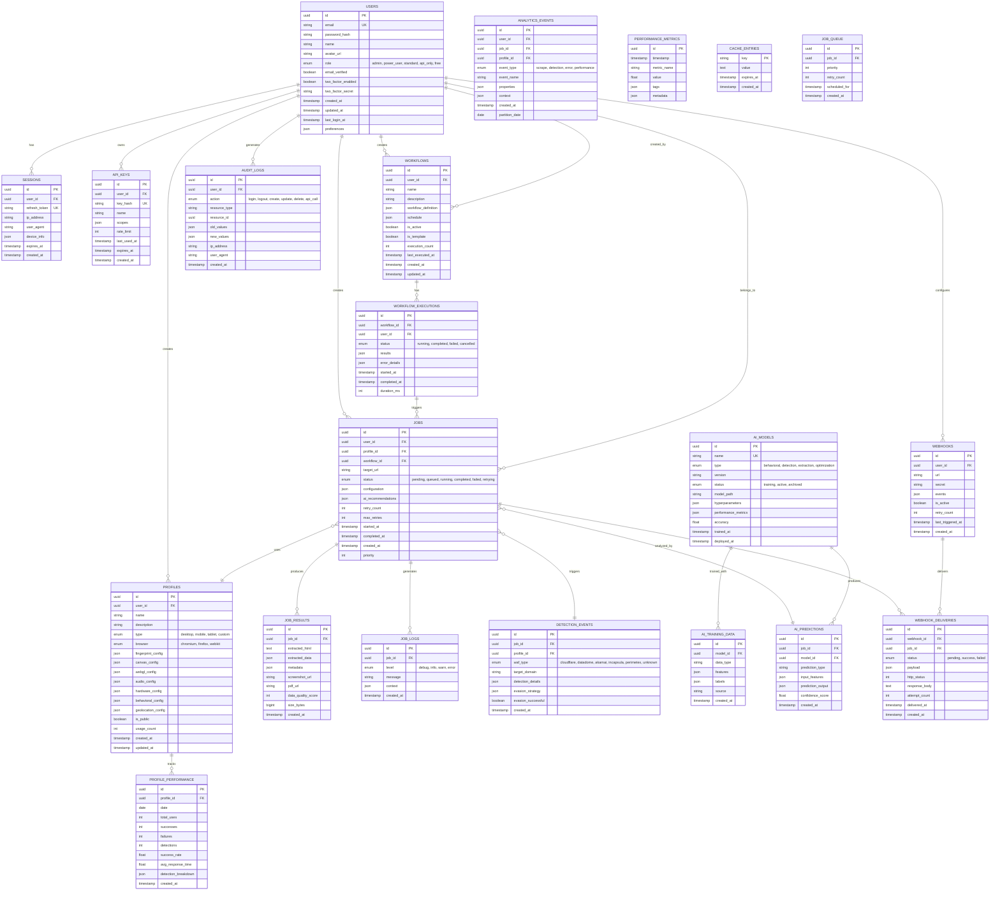

```mermaid
erDiagram
    %% User Management
    USERS ||--o{ SESSIONS : has
    USERS ||--o{ API_KEYS : owns
    USERS ||--o{ JOBS : creates
    USERS ||--o{ WORKFLOWS : creates
    USERS ||--o{ PROFILES : creates
    USERS {
        uuid id PK
        string email UK
        string password_hash
        string name
        string avatar_url
        enum role "admin, power_user, standard, api_only, free"
        boolean email_verified
        boolean two_factor_enabled
        string two_factor_secret
        timestamp created_at
        timestamp updated_at
        timestamp last_login_at
        json preferences
    }
    
    SESSIONS {
        uuid id PK
        uuid user_id FK
        string refresh_token UK
        string ip_address
        string user_agent
        json device_info
        timestamp expires_at
        timestamp created_at
    }
    
    API_KEYS {
        uuid id PK
        uuid user_id FK
        string key_hash UK
        string name
        json scopes
        int rate_limit
        timestamp last_used_at
        timestamp expires_at
        timestamp created_at
    }
    
    %% Job Management
    JOBS ||--o{ JOB_RESULTS : produces
    JOBS }o--|| PROFILES : uses
    JOBS }o--|| USERS : belongs_to
    JOBS ||--o{ JOB_LOGS : generates
    JOBS {
        uuid id PK
        uuid user_id FK
        uuid profile_id FK
        uuid workflow_id FK
        string target_url
        enum status "pending, queued, running, completed, failed, retrying"
        json configuration
        json ai_recommendations
        int retry_count
        int max_retries
        timestamp started_at
        timestamp completed_at
        timestamp created_at
        int priority
    }
    
    JOB_RESULTS {
        uuid id PK
        uuid job_id FK
        text extracted_html
        json extracted_data
        json metadata
        string screenshot_url
        string pdf_url
        int data_quality_score
        bigint size_bytes
        timestamp created_at
    }
    
    JOB_LOGS {
        uuid id PK
        uuid job_id FK
        enum level "debug, info, warn, error"
        string message
        json context
        timestamp created_at
    }
    
    %% Profile Management
    PROFILES ||--o{ PROFILE_PERFORMANCE : tracks
    PROFILES {
        uuid id PK
        uuid user_id FK
        string name
        string description
        enum type "desktop, mobile, tablet, custom"
        enum browser "chromium, firefox, webkit"
        json fingerprint_config
        json canvas_config
        json webgl_config
        json audio_config
        json hardware_config
        json behavioral_config
        json geolocation_config
        boolean is_public
        int usage_count
        timestamp created_at
        timestamp updated_at
    }
    
    PROFILE_PERFORMANCE {
        uuid id PK
        uuid profile_id FK
        date date
        int total_uses
        int successes
        int failures
        int detections
        float success_rate
        float avg_response_time
        json detection_breakdown
        timestamp created_at
    }
    
    %% Workflow Management
    WORKFLOWS ||--o{ WORKFLOW_EXECUTIONS : has
    WORKFLOWS }o--|| USERS : created_by
    WORKFLOWS {
        uuid id PK
        uuid user_id FK
        string name
        string description
        json workflow_definition
        json schedule
        boolean is_active
        boolean is_template
        int execution_count
        timestamp last_executed_at
        timestamp created_at
        timestamp updated_at
    }
    
    WORKFLOW_EXECUTIONS ||--o{ JOBS : triggers
    WORKFLOW_EXECUTIONS {
        uuid id PK
        uuid workflow_id FK
        uuid user_id FK
        enum status "running, completed, failed, cancelled"
        json results
        json error_details
        timestamp started_at
        timestamp completed_at
        int duration_ms
    }
    
    %% Analytics & Metrics
    ANALYTICS_EVENTS {
        uuid id PK
        uuid user_id FK
        uuid job_id FK
        uuid profile_id FK
        enum event_type "scrape, detection, error, performance"
        string event_name
        json properties
        json context
        timestamp created_at
        date partition_date
    }
    
    PERFORMANCE_METRICS {
        uuid id PK
        timestamp timestamp
        string metric_name
        float value
        json tags
        json metadata
    }
    
    DETECTION_EVENTS {
        uuid id PK
        uuid job_id FK
        uuid profile_id FK
        enum waf_type "cloudflare, datadome, akamai, incapsula, perimetex, unknown"
        string target_domain
        json detection_details
        json evasion_strategy
        boolean evasion_successful
        timestamp created_at
    }
    
    %% AI Models
    AI_MODELS {
        uuid id PK
        string name UK
        enum type "behavioral, detection, extraction, optimization"
        string version
        enum status "training, active, archived"
        string model_path
        json hyperparameters
        json performance_metrics
        float accuracy
        timestamp trained_at
        timestamp deployed_at
    }
    
    AI_TRAINING_DATA {
        uuid id PK
        uuid model_id FK
        string data_type
        json features
        json labels
        string source
        timestamp created_at
    }
    
    AI_PREDICTIONS {
        uuid id PK
        uuid job_id FK
        uuid model_id FK
        string prediction_type
        json input_features
        json prediction_output
        float confidence_score
        timestamp created_at
    }
    
    %% Webhooks
    USERS ||--o{ WEBHOOKS : configures
    WEBHOOKS {
        uuid id PK
        uuid user_id FK
        string url
        string secret
        json events
        boolean is_active
        int retry_count
        timestamp last_triggered_at
        timestamp created_at
    }
    
    WEBHOOK_DELIVERIES {
        uuid id PK
        uuid webhook_id FK
        uuid job_id FK
        enum status "pending, success, failed"
        json payload
        int http_status
        text response_body
        int attempt_count
        timestamp delivered_at
        timestamp created_at
    }
    
    %% Audit Logs
    AUDIT_LOGS {
        uuid id PK
        uuid user_id FK
        enum action "login, logout, create, update, delete, api_call"
        string resource_type
        uuid resource_id
        json old_values
        json new_values
        string ip_address
        string user_agent
        timestamp created_at
    }
    
    %% Cache & Queue
    CACHE_ENTRIES {
        string key PK
        text value
        timestamp expires_at
        timestamp created_at
    }
    
    JOB_QUEUE {
        uuid id PK
        uuid job_id FK
        int priority
        int retry_count
        timestamp scheduled_for
        timestamp created_at
    }
    
    %% Relationships
    JOBS }o--|| AI_PREDICTIONS : analyzed_by
    JOBS }o--|| DETECTION_EVENTS : triggers
    JOBS ||--o{ WEBHOOK_DELIVERIES : notifies
    AI_MODELS ||--o{ AI_TRAINING_DATA : trained_with
    AI_MODELS ||--o{ AI_PREDICTIONS : produces
    USERS ||--o{ AUDIT_LOGS : generates
    WEBHOOKS ||--o{ WEBHOOK_DELIVERIES : delivers
```
