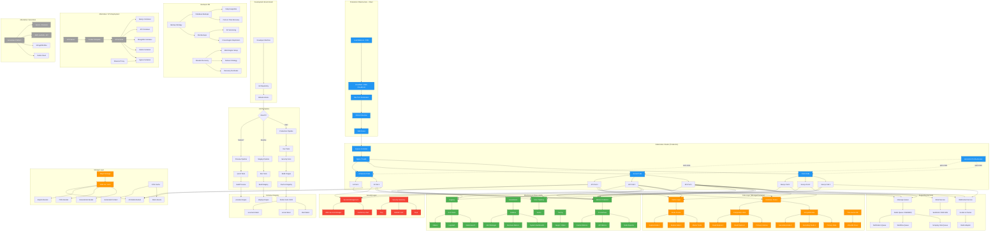

```mermaid
graph TB
    subgraph "Development Environment"
        A[Developer Machine] --> B[Git Repository]
        B --> C[GitHub Actions]
    end
    
    subgraph "CI/CD Pipeline"
        C --> D{Branch?}
        D -->|main| E[Production Pipeline]
        D -->|develop| F[Staging Pipeline]
        D -->|feature/*| G[Preview Pipeline]
        
        E --> E1[Run Tests]
        E1 --> E2[Security Scan]
        E2 --> E3[Build Images]
        E3 --> E4[Push to Registry]
        
        F --> F1[Run Tests]
        F1 --> F2[Build Staging]
        
        G --> G1[Quick Tests]
        G1 --> G2[Build Preview]
    end
    
    subgraph "Container Registry"
        E4 --> H[Docker Hub / ECR]
        H --> H1[client:latest]
        H --> H2[server:latest]
        H --> H3[ai-service:latest]
        F2 --> H4[staging images]
        G2 --> H5[preview images]
    end
    
    subgraph "Production Infrastructure - Cloud"
        I[Load Balancer / CDN]
        I --> I1[Cloudflare / AWS CloudFront]
        I1 --> I2[SSL/TLS Termination]
        I2 --> I3[DDoS Protection]
        I3 --> I4[WAF Rules]
    end
    
    subgraph "Kubernetes Cluster (Production)"
        I4 --> J[Ingress Controller]
        J --> J1[Nginx / Traefik]
        
        J1 --> K[Client Pods]
        K --> K1[Next.js Pod 1]
        K --> K2[Next.js Pod 2]
        K --> K3[Next.js Pod 3]
        
        J1 --> L[Server Pods]
        L --> L1[API Pod 1]
        L --> L2[API Pod 2]
        L --> L3[API Pod 3]
        
        J1 --> M[AI Service Pods]
        M --> M1[AI Pod 1]
        M --> M2[AI Pod 2]
        
        N[Horizontal Pod Autoscaler]
        N -.auto-scale.-> K
        N -.auto-scale.-> L
        N -.auto-scale.-> M
    end
    
    subgraph "Data Layer (Managed Services)"
        O[Database Cluster]
        O --> O1[MongoDB Atlas]
        O1 --> O2[Primary Node]
        O1 --> O3[Secondary Node 1]
        O1 --> O4[Secondary Node 2]
        
        O --> O5[PostgreSQL RDS]
        O5 --> O6[Primary Instance]
        O5 --> O7[Read Replica 1]
        O5 --> O8[Read Replica 2]
        
        P[Cache Layer]
        P --> P1[Redis Cluster]
        P1 --> P2[Master Node]
        P1 --> P3[Replica Node 1]
        P1 --> P4[Replica Node 2]
        
        Q[Time-Series DB]
        Q --> Q1[InfluxDB Cloud]
    end
    
    subgraph "Storage Layer"
        R[Object Storage]
        R --> R1[AWS S3 / GCS]
        R1 --> R2[Screenshots Bucket]
        R1 --> R3[PDFs Bucket]
        R1 --> R4[Exports Bucket]
        R1 --> R5[AI Models Bucket]
        
        S[CDN Cache]
        S --> S1[Static Assets]
        S --> S2[Generated Content]
    end
    
    subgraph "Supporting Services"
        T[Message Queue]
        T --> T1[Redis Queue / RabbitMQ]
        T1 --> T2[Scraping Jobs Queue]
        T1 --> T3[Workflow Queue]
        T1 --> T4[Notification Queue]
        
        U[WebSocket Service]
        U --> U1[Socket.io Cluster]
        U1 --> U2[Redis Adapter]
        
        V[Email Service]
        V --> V1[SendGrid / AWS SES]
    end
    
    subgraph "Monitoring & Observability"
        W[Metrics Collection]
        W --> W1[Prometheus]
        W1 --> W2[Node Exporter]
        W1 --> W3[API Metrics]
        W1 --> W4[Custom Metrics]
        
        X[Visualization]
        X --> X1[Grafana]
        X1 --> X2[System Dashboards]
        X1 --> X3[Business Metrics]
        X1 --> X4[Alert Manager]
        
        Y[Logging]
        Y --> Y1[ELK Stack]
        Y1 --> Y2[Elasticsearch]
        Y1 --> Y3[Logstash]
        Y1 --> Y4[Kibana]
        
        Z[Tracing]
        Z --> Z1[Jaeger / Zipkin]
        
        AA[Error Tracking]
        AA --> AA1[Sentry]
    end
    
    subgraph "Security Layer"
        AB[Secrets Management]
        AB --> AB1[HashiCorp Vault]
        AB --> AB2[AWS Secrets Manager]
        
        AC[Security Scanning]
        AC --> AC1[Snyk]
        AC --> AC2[OWASP ZAP]
        AC --> AC3[Trivy]
    end
    
    subgraph "Backup & DR"
        AD[Backup Strategy]
        AD --> AD1[Database Backups]
        AD1 --> AD2[Daily Snapshots]
        AD1 --> AD3[Point-in-Time Recovery]
        
        AD --> AD4[File Backups]
        AD4 --> AD5[S3 Versioning]
        AD4 --> AD6[Cross-Region Replication]
        
        AE[Disaster Recovery]
        AE --> AE1[Multi-Region Setup]
        AE --> AE2[Failover Strategy]
        AE --> AE3[Recovery Runbooks]
    end
    
    subgraph "Alternative: VPS Deployment"
        AF[VPS Server]
        AF --> AF1[Docker Compose]
        AF1 --> AF2[All Services]
        AF2 --> AF3[Next.js Container]
        AF2 --> AF4[API Container]
        AF2 --> AF5[MongoDB Container]
        AF2 --> AF6[Redis Container]
        AF2 --> AF7[Nginx Container]
        
        AG[Reverse Proxy]
        AG --> AF7
    end
    
    subgraph "Alternative: Serverless"
        AH[Serverless Platform]
        AH --> AH1[Vercel - Frontend]
        AH --> AH2[AWS Lambda - API]
        AH --> AH3[MongoDB Atlas]
        AH --> AH4[Redis Cloud]
    end
    
    %% Connections
    L1 --> O
    L2 --> O
    L3 --> O
    
    L1 --> P
    L2 --> P
    L3 --> P
    
    M1 --> R5
    M2 --> R5
    
    L1 --> T
    L2 --> T
    L3 --> T
    
    K1 --> U
    K2 --> U
    K3 --> U
    
    L1 --> V
    
    K1 --> W
    K2 --> W
    K3 --> W
    L1 --> W
    L2 --> W
    L3 --> W
    M1 --> W
    M2 --> W
    
    L1 --> Y
    L2 --> Y
    L3 --> Y
    
    K1 --> AA
    L1 --> AA
    M1 --> AA
    
    L1 --> AB
    L2 --> AB
    M1 --> AB
    
    %% Styling
    classDef infrastructure fill:#2196F3,stroke:#1565C0,color:#fff
    classDef data fill:#FF9800,stroke:#E65100,color:#fff
    classDef security fill:#F44336,stroke:#C62828,color:#fff
    classDef monitoring fill:#4CAF50,stroke:#2E7D32,color:#fff
    classDef optional fill:#9E9E9E,stroke:#616161,color:#fff
    
    class I,I1,I2,I3,I4,J,J1,K,L,M,N infrastructure
    class O,O1,O2,O3,O4,O5,O6,O7,O8,P,P1,P2,P3,P4,Q,Q1,R,R1 data
    class AB,AB1,AB2,AC,AC1,AC2,AC3 security
    class W,W1,W2,W3,W4,X,X1,X2,X3,X4,Y,Y1,Y2,Y3,Y4,Z,Z1,AA,AA1 monitoring
    class AF,AF1,AF2,AH,AH1,AH2 optional
```
