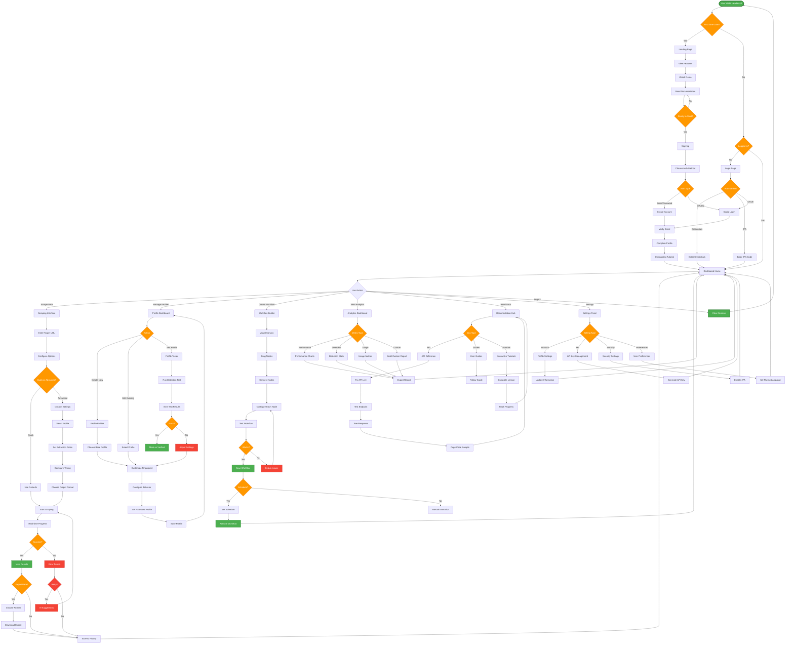

```mermaid
graph TD
    Start([User Visits HeadlessX]) --> A{First Time User?}
    
    A -->|Yes| B[Landing Page]
    A -->|No| C{Logged In?}
    
    B --> B1[View Features]
    B1 --> B2[Watch Demo]
    B2 --> B3[Read Documentation]
    B3 --> B4{Ready to Start?}
    
    B4 -->|Yes| D[Sign Up]
    B4 -->|No| B3
    
    D --> D1[Choose Auth Method]
    D1 --> D2{Auth Type}
    D2 -->|Email/Password| E[Create Account]
    D2 -->|OAuth2| F[Social Login]
    
    E --> G[Verify Email]
    F --> G
    G --> H[Complete Profile]
    H --> I[Onboarding Tutorial]
    
    C -->|No| J[Login Page]
    C -->|Yes| K[Dashboard Home]
    
    J --> J1{Auth Method}
    J1 -->|Credentials| L[Enter Credentials]
    J1 -->|2FA| M[Enter 2FA Code]
    J1 -->|OAuth| F
    
    L --> K
    M --> K
    
    I --> K
    
    K --> N{User Action}
    
    %% Scraping Flow
    N -->|Scrape Data| O[Scraping Interface]
    O --> O1[Enter Target URL]
    O1 --> O2[Configure Options]
    O2 --> O3{Quick or Advanced?}
    
    O3 -->|Quick| P[Use Defaults]
    O3 -->|Advanced| Q[Custom Settings]
    
    Q --> Q1[Select Profile]
    Q1 --> Q2[Set Extraction Rules]
    Q2 --> Q3[Configure Timing]
    Q3 --> Q4[Choose Output Format]
    
    P --> R[Start Scraping]
    Q4 --> R
    
    R --> S[Real-time Progress]
    S --> T{Success?}
    
    T -->|Yes| U[View Results]
    T -->|No| V[Error Details]
    
    U --> U1{Export Data?}
    U1 -->|Yes| W[Choose Format]
    U1 -->|No| X[Save to History]
    
    W --> W1[Download/Export]
    W1 --> X
    
    V --> V1{Retry?}
    V1 -->|Yes| V2[AI Suggestions]
    V1 -->|No| X
    V2 --> R
    
    %% Profile Management Flow
    N -->|Manage Profiles| Y[Profile Dashboard]
    Y --> Y1{Action}
    
    Y1 -->|Create New| Z[Profile Builder]
    Y1 -->|Edit Existing| AA[Select Profile]
    Y1 -->|Test Profile| AB[Profile Tester]
    
    Z --> Z1[Choose Base Profile]
    Z1 --> Z2[Customize Fingerprint]
    Z2 --> Z3[Configure Behavior]
    Z3 --> Z4[Set Hardware Profile]
    Z4 --> Z5[Save Profile]
    
    AA --> Z2
    AB --> AC[Run Detection Test]
    AC --> AD[View Test Results]
    AD --> AE{Pass?}
    AE -->|Yes| AF[Mark as Verified]
    AE -->|No| AG[Adjust Settings]
    AG --> Z2
    
    %% Workflow Builder Flow
    N -->|Create Workflow| AH[Workflow Builder]
    AH --> AI[Visual Canvas]
    AI --> AJ[Drag Nodes]
    AJ --> AK[Connect Nodes]
    AK --> AL[Configure Each Node]
    AL --> AM[Test Workflow]
    AM --> AN{Works?}
    AN -->|Yes| AO[Save Workflow]
    AN -->|No| AP[Debug Issues]
    AP --> AL
    
    AO --> AQ{Schedule?}
    AQ -->|Yes| AR[Set Schedule]
    AQ -->|No| AS[Manual Execution]
    
    AR --> AT[Activate Workflow]
    
    %% Analytics Flow
    N -->|View Analytics| AU[Analytics Dashboard]
    AU --> AV{Metric Type}
    AV -->|Performance| AW[Performance Charts]
    AV -->|Detection| AX[Detection Stats]
    AV -->|Usage| AY[Usage Metrics]
    AV -->|Custom| AZ[Build Custom Report]
    
    AW --> BA[Export Report]
    AX --> BA
    AY --> BA
    AZ --> BA
    
    %% Documentation Flow
    N -->|Read Docs| BB[Documentation Hub]
    BB --> BC{Doc Type}
    BC -->|API| BD[API Reference]
    BC -->|Guides| BE[User Guides]
    BC -->|Tutorials| BF[Interactive Tutorials]
    
    BD --> BG[Try API Live]
    BG --> BH[Test Endpoint]
    BH --> BI[See Response]
    BI --> BJ[Copy Code Sample]
    
    BE --> BK[Follow Guide]
    BF --> BL[Complete Lesson]
    BL --> BM[Track Progress]
    
    %% Settings Flow
    N -->|Settings| BN[Settings Panel]
    BN --> BO{Setting Type}
    BO -->|Account| BP[Profile Settings]
    BO -->|API| BQ[API Key Management]
    BO -->|Security| BR[Security Settings]
    BO -->|Preferences| BS[User Preferences]
    
    BP --> BT[Update Information]
    BQ --> BU[Generate API Key]
    BR --> BV[Enable 2FA]
    BS --> BW[Set Theme/Language]
    
    %% Logout
    N -->|Logout| BX[Clear Session]
    BX --> Start
    
    X --> K
    Z5 --> Y
    AT --> K
    BA --> K
    BJ --> BB
    BM --> BB
    BT --> K
    BU --> K
    BV --> K
    BW --> K
    
    %% Styling
    classDef startEnd fill:#4CAF50,stroke:#2E7D32,color:#fff,stroke-width:3px
    classDef process fill:#2196F3,stroke:#1565C0,color:#fff
    classDef decision fill:#FF9800,stroke:#E65100,color:#fff
    classDef success fill:#4CAF50,stroke:#2E7D32,color:#fff
    classDef error fill:#F44336,stroke:#C62828,color:#fff
    
    class Start,BX startEnd
    class T,A,C,B4,D2,J1,O3,U1,V1,Y1,AE,AN,AQ,AV,BC,BO decision
    class U,AF,AO,AT success
    class V,V1,V2,AG,AP error
```
