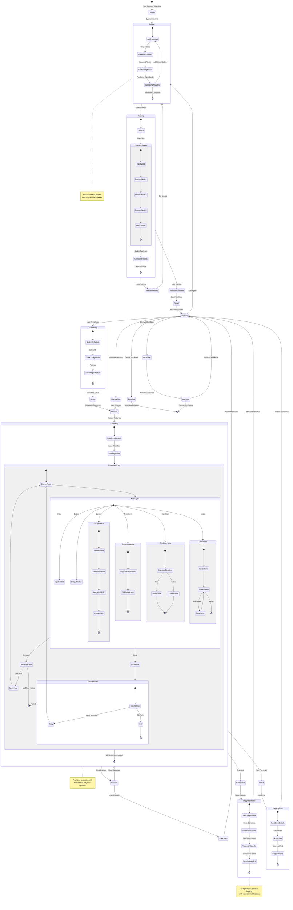

```mermaid
stateDiagram-v2
    [*] --> Created: User Creates Workflow
    
    Created --> Editing: Open in Builder
    
    state Editing {
        [*] --> AddingNodes
        AddingNodes --> ConnectingNodes: Drag Nodes
        ConnectingNodes --> ConfiguringNodes: Connect Nodes
        ConfiguringNodes --> ValidatingWorkflow: Configure Each Node
        ValidatingWorkflow --> AddingNodes: Add More Nodes
        ValidatingWorkflow --> [*]: Validation Complete
    }
    
    Editing --> Testing: Test Workflow
    
    state Testing {
        [*] --> DryRun
        DryRun --> ExecutingNodes: Start Test
        
        state ExecutingNodes {
            [*] --> InputNode
            InputNode --> ProcessNode1
            ProcessNode1 --> ProcessNode2
            ProcessNode2 --> ProcessNode3
            ProcessNode3 --> OutputNode
            OutputNode --> [*]
        }
        
        ExecutingNodes --> CheckingResults: Nodes Executed
        CheckingResults --> [*]: Test Complete
    }
    
    Testing --> ValidationFailed: Errors Found
    Testing --> ValidationSuccess: Test Passed
    
    ValidationFailed --> Editing: Fix Issues
    ValidationSuccess --> Saved: Save Workflow
    
    Saved --> Inactive: Workflow Saved
    
    Inactive --> Scheduling: User Schedules
    Inactive --> ManualRun: Manual Execution
    
    state Scheduling {
        [*] --> SettingSchedule
        SettingSchedule --> CronConfiguration: Set Cron
        CronConfiguration --> ActivatingSchedule: Activate
        ActivatingSchedule --> [*]
    }
    
    Scheduling --> Active: Schedule Active
    Active --> Queued: Schedule Triggered
    ManualRun --> Queued: User Triggers
    
    Queued --> Executing: Worker Picks Up
    
    state Executing {
        [*] --> InitializingContext
        InitializingContext --> LoadingNodes: Load Workflow
        LoadingNodes --> ExecutionLoop
        
        state ExecutionLoop {
            [*] --> CurrentNode
            CurrentNode --> NodeType
            
            state NodeType {
                [*] --> InputNode2: Input
                [*] --> ScrapeNode: Scrape
                [*] --> TransformNode: Transform
                [*] --> ConditionNode: Condition
                [*] --> LoopNode: Loop
                [*] --> OutputNode2: Output
                
                state ScrapeNode {
                    [*] --> SelectProfile
                    SelectProfile --> LaunchBrowser
                    LaunchBrowser --> NavigateToURL
                    NavigateToURL --> ExtractData
                    ExtractData --> [*]
                }
                
                state TransformNode {
                    [*] --> ApplyTransformation
                    ApplyTransformation --> ValidateOutput
                    ValidateOutput --> [*]
                }
                
                state ConditionNode {
                    [*] --> EvaluateCondition
                    EvaluateCondition --> TrueBranch: True
                    EvaluateCondition --> FalseBranch: False
                    TrueBranch --> [*]
                    FalseBranch --> [*]
                }
                
                state LoopNode {
                    [*] --> IterateItems
                    IterateItems --> ProcessItem
                    ProcessItem --> MoreItems: Has More
                    ProcessItem --> [*]: Done
                    MoreItems --> ProcessItem
                }
            }
            
            NodeType --> NodeSuccess: Success
            NodeType --> NodeError: Error
            
            NodeSuccess --> NextNode: Has Next
            NodeSuccess --> [*]: No More Nodes
            
            NodeError --> ErrorHandler
            
            state ErrorHandler {
                [*] --> CheckRetry
                CheckRetry --> Retry: Retry Available
                CheckRetry --> Fail: No Retry
                Retry --> CurrentNode
                Fail --> [*]
            }
            
            ErrorHandler --> [*]: Failed
            NextNode --> CurrentNode
        }
        
        ExecutionLoop --> [*]: All Nodes Processed
    }
    
    Executing --> Completed: Success
    Executing --> Failed: Error Occurred
    Executing --> Paused: User Pauses
    
    Paused --> Executing: User Resumes
    Paused --> Cancelled: User Cancels
    
    Completed --> LoggingResults: Store Results
    Failed --> LoggingError: Log Error
    
    state LoggingResults {
        [*] --> SaveToDatabase
        SaveToDatabase --> SendNotifications: Save Complete
        SendNotifications --> TriggerWebhooks: Notify Complete
        TriggerWebhooks --> UpdateAnalytics: Webhooks Sent
        UpdateAnalytics --> [*]
    }
    
    state LoggingError {
        [*] --> SaveErrorDetails
        SaveErrorDetails --> NotifyUser: Log Saved
        NotifyUser --> SuggestFixes: User Notified
        SuggestFixes --> [*]
    }
    
    LoggingResults --> Inactive: Return to Inactive
    LoggingError --> Inactive: Return to Inactive
    Cancelled --> Inactive: Return to Inactive
    
    Inactive --> Editing: Edit Again
    Inactive --> Archiving: Archive Workflow
    Inactive --> Deleting: Delete Workflow
    
    Archiving --> Archived: Workflow Archived
    Deleting --> [*]: Workflow Deleted
    
    Archived --> Inactive: Restore Workflow
    Archived --> [*]: Permanent Delete
    
    note right of Editing
        Visual workflow builder
        with drag-and-drop nodes
    end note
    
    note right of Executing
        Real-time execution with
        WebSocket progress updates
    end note
    
    note right of LoggingResults
        Comprehensive result logging
        with webhook notifications
    end note
```
